# Manuale Utente - Produzione

Data aggiornamento: 8 aprile 2026
Versione applicazione di riferimento: 1.0.0

## 1. Scopo
Questo manuale descrive:
- ruoli applicativi e perimetro di visibilita;
- voci di menu disponibili;
- funzione operativa di ogni pagina;
- videate principali dell'applicazione.

## 2. Accesso applicazione
- Frontend sviluppo: `https://localhost:5643`
- Backend sviluppo: `https://localhost:7643`
- Autenticazione centralizzata: Auth SSO
- Cambio profilo: selettore `Profilo` nella barra in alto a destra.

## 3. Ruoli applicativi
Ruoli riconosciuti dal catalogo profili (`ProfileCatalog`):

| Codice | Ruolo |
|---|---|
| CDG, PRES | Supervisore |
| RP | Responsabile Produzione |
| RC | Responsabile Commerciale |
| PM | Project Manager |
| RCC | Responsabile Commerciale Commessa |
| GPM | General Project Manager |
| HR | Risorse Umane |
| (da scope OU) | Responsabile OU |

Note operative:
- Il ruolo `Supervisore` puo impersonificare altri utenti.
- Se non viene individuato alcun profilo valido, il sistema effettua logout automatico.

## 4. Matrice accesso menu
Legenda: `SI` accesso al menu, `-` non previsto.

| Menu | Sup | Resp Prod | Resp Comm | RCC | PM | GPM | ROU | HR |
|---|---|---|---|---|---|---|---|---|
| Analisi Commesse | SI | SI | SI | SI | SI | SI | SI | - |
| Dati Contabili | SI | SI | SI | SI | SI | SI | SI | - |
| Analisi Risorse | SI | SI | SI | SI | - | SI | SI | SI |
| Analisi Proiezioni | SI | SI | SI | SI | - | - | SI | - |
| Previsioni | SI | SI | SI | SI | - | - | SI (BU) | - |
| Processo Offerta | SI | SI | SI | SI | - | - | SI | - |
| Menu Utente (Info/Info applicazione/Logout) | SI | SI | SI | SI | SI | SI | SI | SI |

### 4.1 Regole perimetro dati (sintesi)
- Supervisore / Responsabile Commerciale / Responsabile Produzione: visione complessiva nelle pagine abilitate.
- RCC: visione limitata al proprio perimetro RCC.
- ROU: visione limitata alla/e propria/e OU.
- PM/GPM: visione secondo autorizzazioni su commesse/ambiti disponibili.
- HR: accesso alle sole pagine del menu Analisi Risorse.

## 5. Struttura generale interfaccia
- Barra alta con menu principali.
- Stato API e versione applicativa sempre visibili.
- Selettore profilo contestuale.
- Menu utente con:
  - `Info`
  - `Info applicazione` (modificabile dal Supervisore)
  - `Impersonifica` (solo Supervisore)
  - `Logout`

## 6. Menu e funzionalita

### 6.1 Analisi Commesse
1. **Commesse**
   - Vista principale con filtri estesi (anni, attive dal, commessa, tipologia, stato, macrotipologia, BU, controparte, RCC, PM).
   - Supporta dettaglio/aggregazione, export Excel, apertura dettaglio commessa.
2. **Prodotti**
   - Vista sintetica per prodotto con raggruppamento, espansione/riduzione e totali.
3. **Andamento Mensile**
   - Monitoraggio mensile di ore, costi, ricavi, ricavi maturati e utile.
   - Disponibile anche modalita aggregata fino a mese selezionato.
4. **Dati Annuali Aggregati**
   - Analisi tipo pivot con scelta campi di aggregazione e filtri dedicati.
5. **Utile Mensile RCC**
   - Report utile mensile per RCC.
6. **Utile Mensile BU**
   - Report utile mensile per Business Unit.

### 6.2 Analisi Risorse
1. **Valutazione Annuale**
2. **Pivot Annuale**
3. **Valutazione Mensile**
4. **Pivot Mensile**
5. **Analisi OU Risorse**
6. **Analisi OU Risorse Pivot**
7. **Analisi Mensile OU Risorse**
8. **Analisi Mensile OU Risorse Pivot**

Funzione comune: valorizzazione risultati economici legati alle risorse, con analisi per OU/BU/RCC/PM e viste pivot multilivello.

### 6.3 Analisi Proiezioni
1. **Proiezione Mensile RCC**
2. **Report Annuale RCC**
3. **Proiezione Mensile BU**
4. **Report Annuale BU**
5. **Proiezione Mensile RCC-BU**
6. **Report Annuale RCC-BU**
7. **Piano Fatturazione**

Funzione comune: analisi forecast mensile/annuale su budget, fatturato certo/futuro/ipotetico e indicatori di raggiungimento.

### 6.4 Previsioni
1. **Funnel**
2. **Report Funnel RCC**
3. **Report Funnel BU**

Funzione comune: monitoraggio opportunita/ordini e relative sintesi pivot per RCC o BU.

### 6.5 Processo Offerta
1. **Offerte**
2. **Sintesi RCC**
3. **Sintesi BU**
4. **Percentuale Successo RCC**
5. **Percentuale Successo BU**
6. **Incidenza RCC**
7. **Incidenza BU**

Funzione comune: analisi ciclo offerta (volumi, importi, esiti, percentuali, incidenza).

### 6.6 Dati Contabili
1. **Vendite**
2. **Acquisti**

Funzione comune: consultazione movimenti contabili filtrati secondo perimetro autorizzativo.

## 7. Videate principali

### 7.1 Home applicazione
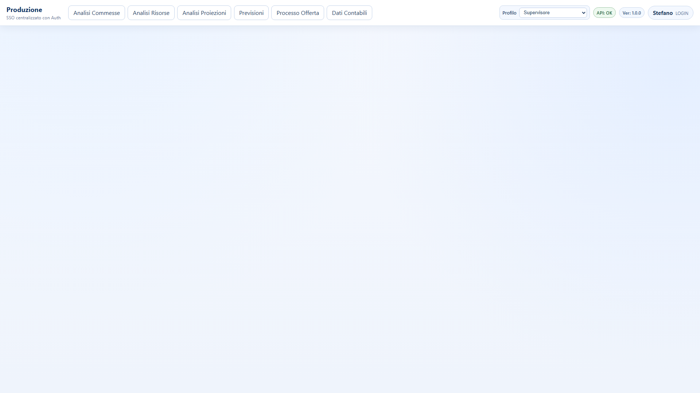

### 7.2 Analisi Commesse - Commesse
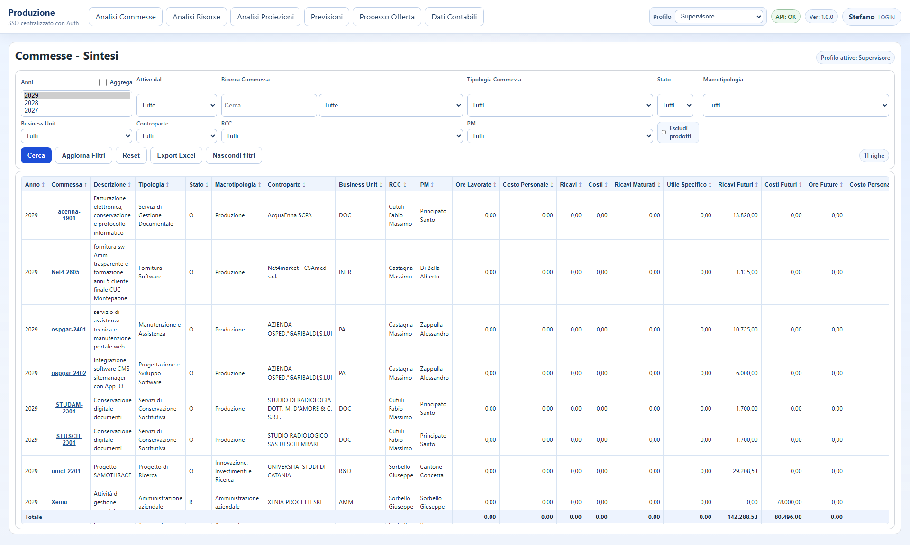

### 7.3 Analisi Commesse - Dettaglio commessa
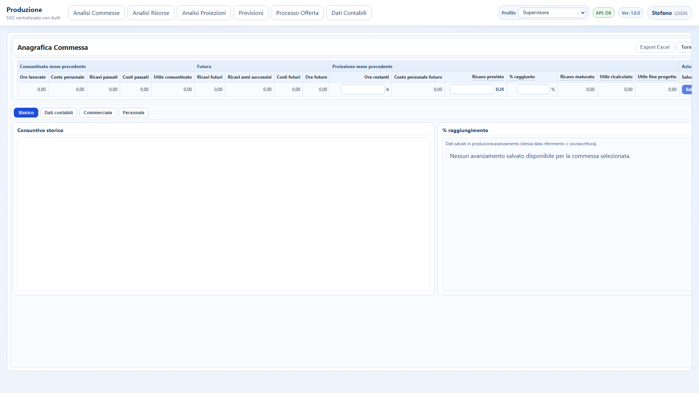

### 7.4 Analisi Commesse - Prodotti
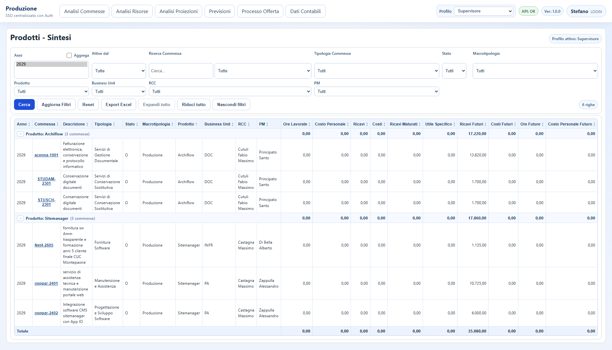

### 7.5 Analisi Commesse - Andamento Mensile
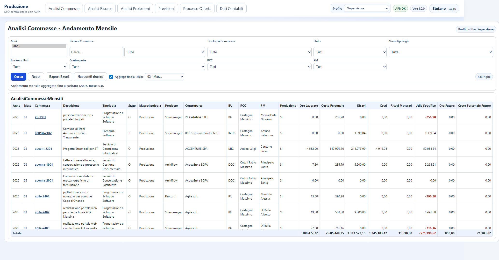

### 7.6 Analisi Commesse - Dati Annuali Aggregati
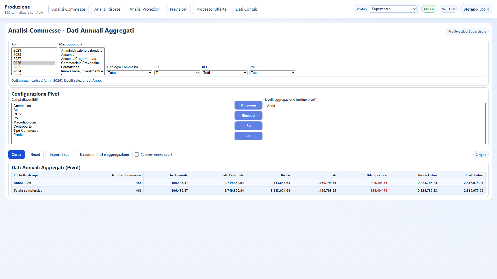

### 7.7 Analisi Risorse - Valutazione Annuale
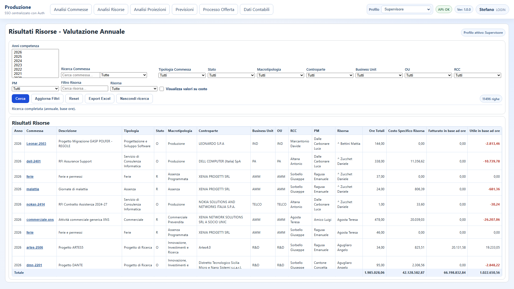

### 7.8 Analisi Proiezioni - Report Annuale RCC
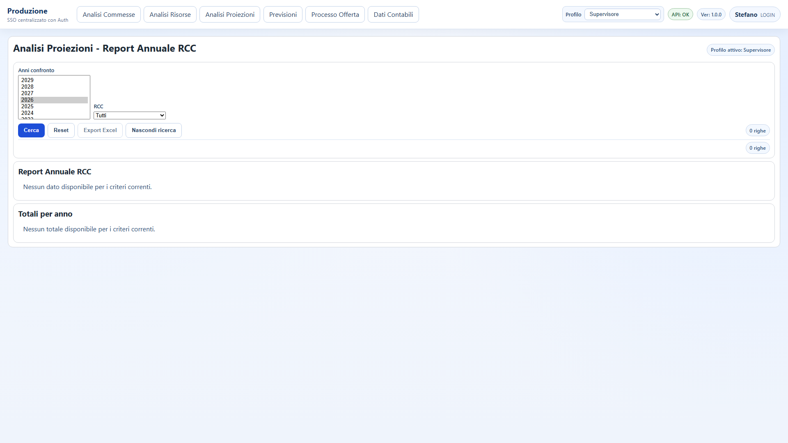

### 7.9 Analisi Proiezioni - Piano Fatturazione
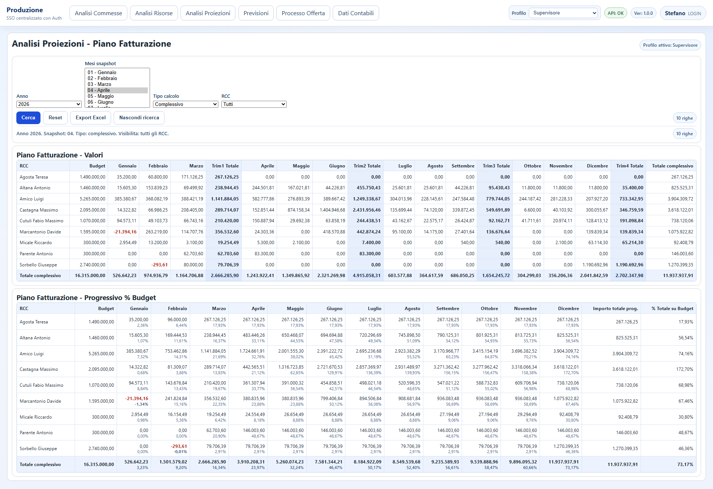

### 7.10 Previsioni - Funnel
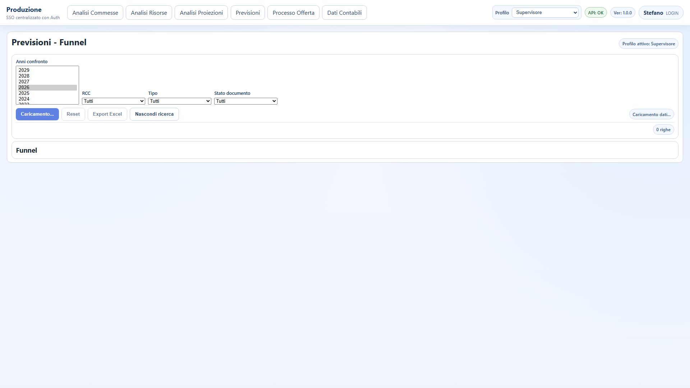

### 7.11 Processo Offerta - Offerte
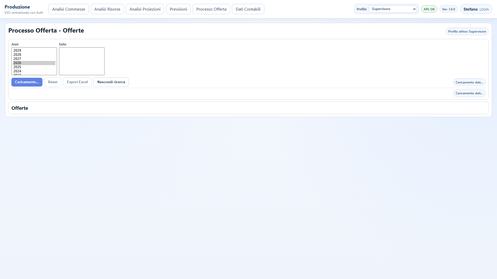

### 7.12 Dati Contabili - Vendite
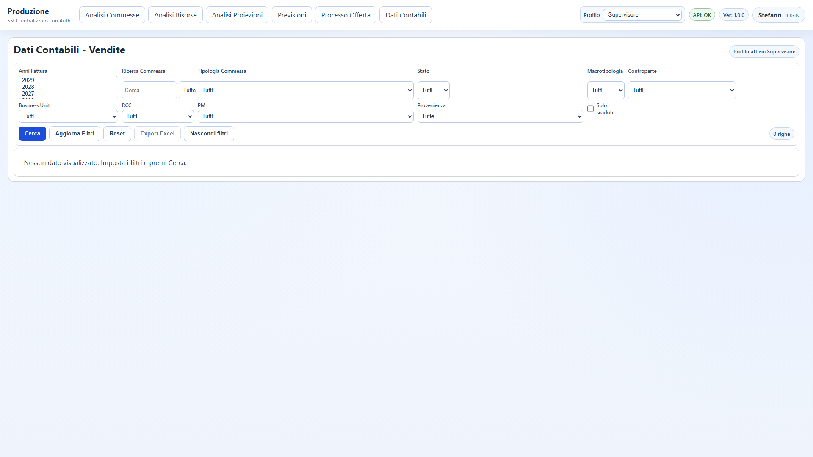

### 7.13 Dati Contabili - Acquisti

### 7.14 Info applicazione
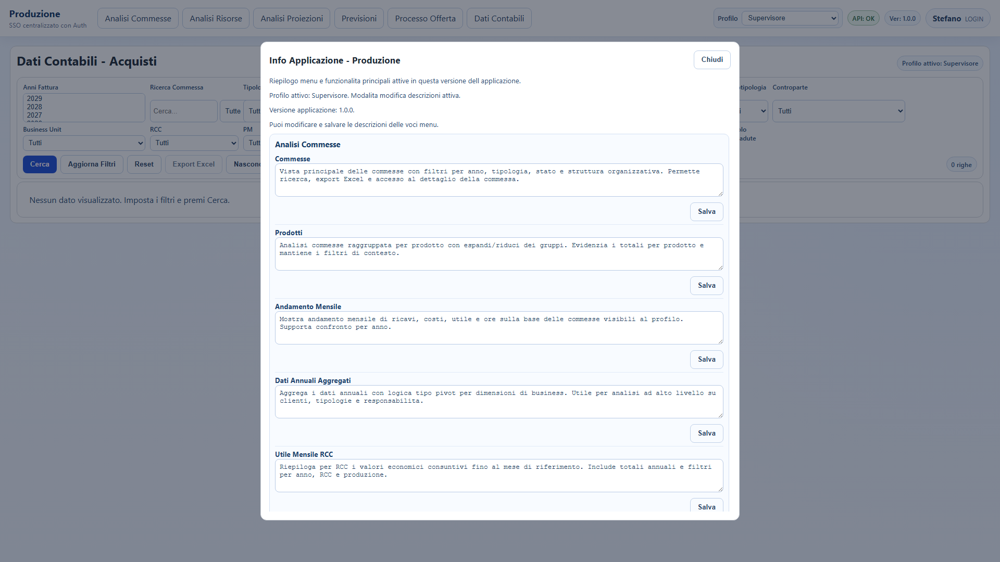

## 8. Note operative
- Tutte le pagine principali supportano export Excel.
- Le pagine con molti filtri consentono la riduzione/espansione area ricerca per aumentare lo spazio dati.
- In dettaglio commessa sono disponibili tab tematici: `Storico`, `Dati contabili`, `Commerciale`, `Personale`.
- Le descrizioni voce menu in `Info applicazione` possono essere aggiornate dal solo profilo Supervisore.

## 9. Manutenzione manuale
Per aggiornare il manuale:
1. verificare nuova versione e nuove voci menu;
2. aggiornare le descrizioni in `Info applicazione`;
3. rigenerare le videate in `docs/manuale/videate`;
4. aggiornare questo documento.
